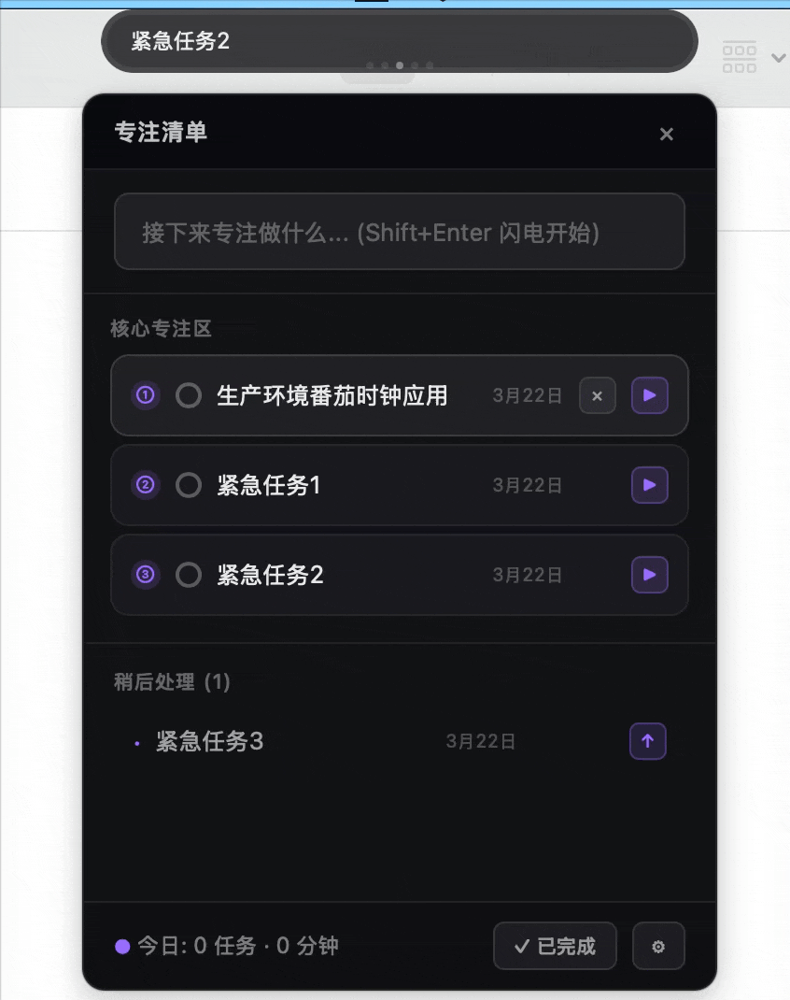

# 专注岛 FocusIsland

<p align="center">
  <strong>屏幕顶部的灵动岛番茄钟</strong><br>
  <em>专注时在，注意力拉回，从不打扰</em>
</p>

<p align="center">
  
  
  
</p>

<p align="center">
  
</p>

---

## ✨ 核心特性

### 🎯 灵动岛形态

一条贴在屏幕顶部的胶囊，实时显示专注进度。既能随时掌握状态，又不会遮挡工作内容。

灵动岛长驻,时刻提醒,将自己的专注力拉回到任务心流中


### 📝 任务管理

- 内置专注清单面板，优先级最高的任务进入核心专注区
- 每个任务自动记录已完成的番茄数
- 统计当天完成的番茄时钟数

### 🎨 高度可定制

- **5 套精美主题** — 经典橙红、海洋蓝绿、薰衣草紫、森林深绿、赛博朋克
- **灵活时长设置** — 专注和休息时长自由调整
- **可调节大小** — 灵动岛尺寸支持 50%~150% 缩放
- **透明度调节** — 适配不同壁纸和视觉偏好
- 随机激励语 为你的专注加油

### ⚡ 轻量高效

基于 Tauri 构建，安装包仅约 5MB，内存占用极低，冷启动秒开。

### 🌍 跨平台支持

支持 macOS、Windows、Linux 三大平台。

---

## 📦 安装

前往 [Releases](../../releases) 页面下载对应平台的安装包：

| 平台 | 文件 |
|------|------|
| macOS (Apple Silicon) | `专注岛_x.x.x_aarch64.dmg` |
| macOS (Intel) | `专注岛_x.x.x_x64.dmg` |
| Windows | `专注岛_x.x.x_x64-setup.exe` |
| Linux | `专注岛_x.x.x_amd64.AppImage` |
| Linux (ARM64) | `专注岛_x.x.x_aarch64.AppImage` |

> Linux 用户下载后需添加执行权限：`chmod +x 专注岛_*.AppImage`

### macOS 常见问题

#### 打开提示 “xxx.app 已损坏，无法打开”

1. 确认已将应用拖入 `应用程序` 文件夹。
2. 打开「终端」，执行以下命令（请根据实际应用名替换路径中的 `灵动岛.app`）：

```bash
xattr -cr /Applications/专注岛.app
```

3. 再次从「应用程序」中打开应用；如仍有安全提示，可在「系统设置 → 隐私与安全性」中允许打开来自未认证开发者的 App。

---

## 🚀 使用指南

### 快速开始

1. **点击灵动岛** 或通过 **系统托盘** 打开专注清单面板
2. 添加任务，点击任务开始专注（默认 25 分钟）
3. 计时结束后自动进入休息（默认 5 分钟）

### 灵动岛状态

| 状态 | 显示内容 |
|------|----------|
| 待机 | 轮播待办任务和激励语 |
| 专注 | 任务名 + 进度环 + 倒计时 |
| 休息 | 绿色主题 + 休息倒计时 |

### 系统托盘

点击系统托盘图标可以：
- 打开专注清单
- 显示/隐藏灵动岛
- 退出应用

---

## 🛠 本地开发

```bash
# 环境要求：Node.js 18+、Rust 1.80+

# 安装依赖
npm install

# 开发模式（热更新）
npm run dev

# 构建生产版本
npm run build
```

---

## 📄 License

MIT
