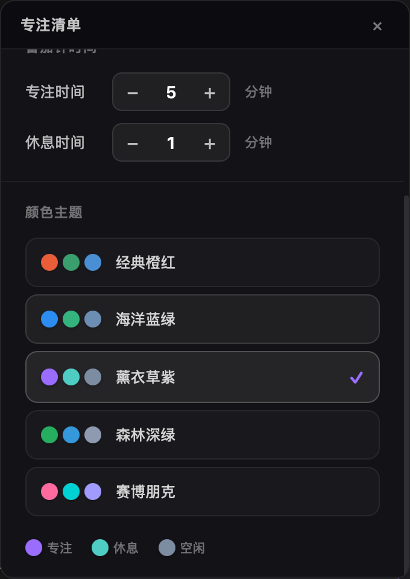

# 专注岛 FocusIsland

> 屏幕顶部的灵动岛番茄钟 —— 专注时在，需要时隐，从不打扰。


<!-- 建议在此处添加一张应用截图或 GIF 动图 -->


<!--  -->

## 为什么选择专注岛

大多数番茄钟应用要么是一个占据屏幕的大窗口，要么藏在系统托盘里容易遗忘。专注岛不同 —— 它借鉴了 Apple 灵动岛的交互理念，以一条贴在屏幕顶部的「胶囊」形态常驻，你能随时看到专注进度，但它绝不会挡住你的工作。

**核心亮点：**

- **灵动岛形态** — 42px 高的胶囊常驻屏幕顶部，实时显示倒计时和进度环
- **智能闪避** — 鼠标靠近自动缩为 2px 细线并开启穿透，移开后恢复，完全不影响操作
- **闲置提醒** — 专注中超过 5 分钟没有操作？橙色脉冲温柔提醒你回来
- **任务管理** — 内置专注清单面板，支持任务分类（今天/明天/本周）和优先级排序
- **番茄计数** — 每个任务自动记录已完成的番茄数，清晰掌握投入
- **5 套主题** — 经典橙红、海洋蓝绿、薰衣草紫、森林深绿、赛博朋克，一键切换
- **自定义时长** — 专注和休息时长可自由调整
- **轻量高效** — 基于 Tauri 构建，安装包仅约 5MB，内存占用极低
- **跨平台** — 支持 macOS、Windows、Linux

## 安装

前往 [Releases](../../releases) 页面下载对应平台的安装包：

| 平台 | 文件 |
|------|------|
| macOS (Apple Silicon) | `专注岛_x.x.x_aarch64.dmg` |
| macOS (Intel) | `专注岛_x.x.x_x64.dmg` |
| Windows | `专注岛_x.x.x_x64-setup.exe` |
| Linux | `专注岛_x.x.x_amd64.AppImage` |
| Linux (ARM64) | `专注岛_x.x.x_aarch64.AppImage` |

> Linux 用户下载后需要添加执行权限：`chmod +x 专注岛_*.AppImage`

## 使用指南

### 开始专注

点击灵动岛上的任务即可开始一个番茄钟（默认 25 分钟）。计时结束后自动进入休息（默认 5 分钟），休息结束回到待机。

### 管理任务

点击灵动岛或通过系统托盘菜单打开「专注清单」面板，在面板中添加、编辑、排序你的任务。

### 灵动岛状态

| 状态 | 表现 |
|------|------|
| 待机 | 轮播展示待办任务和激励语 |
| 专注 | 显示任务名 + 进度环 + 倒计时 |
| 休息 | 绿色主题 + 休息倒计时 |

### 快捷操作

右键点击灵动岛弹出菜单，可以暂停/继续、跳过休息、放弃当前番茄。

## 本地开发

```bash
# 环境要求：Node.js 18+、Rust 1.80+

# 安装依赖
npm install

# 开发模式（热更新）
npm run dev

# 构建
npm run build
```

## License

MIT
